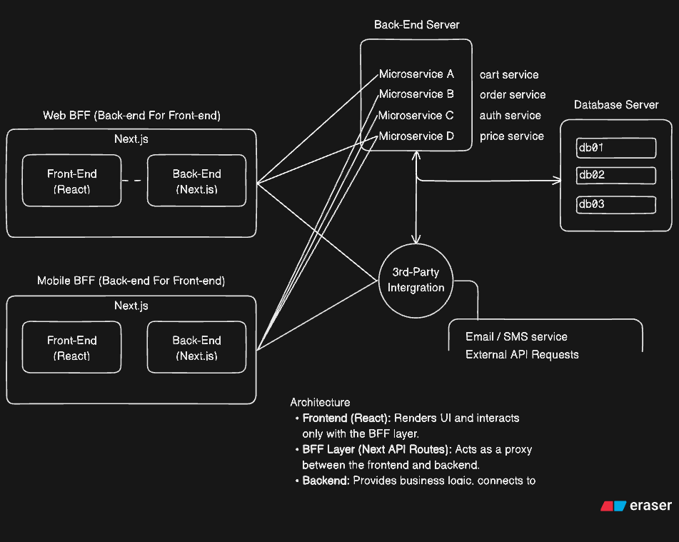

# Level-1-Web-App: Architectural Overview 🏗️

There are two architectural design patterns considered for our sample project:

- [ ] Backend-for-Frontend: Mobile & Web  - _Desired (Recommended Long-Term Approach)_
- [x] 3-Tier Architecture - _Current Implementation_
While the BFF pattern is the recommended long-term approach, the **current implementation** uses a **traditional 3-tier architecture** for simplicity  and isn't necessary as the project is more 'DevOps' focused.

---

---

## 💡 The Why Behind My Recommendation:
Ideally, I'd recommended the architectural design for our online store platform, using the **Backend-for-Frontend (BFF)** pattern. The goal is to provide optimized, decoupled backends for each client experience — ensuring performance, flexibility for scaling, and maintainability.

## 🖥️ Web BFF — Next.js
The **Web BFF** powers the online store’s **web experience**. It’s built with **Next.js**, combining server-side rendering (SSR), static generation, and API routes for interacting with back-end interactions.

## 📱 Mobile BFF
The **Mobile BFF** serves the mobile application (iOS/Android), providing lightweight, optimized endpoints tailored for mobile data consumption. This also would ensure data returned isn't overwhelming the mobile devices; in terms of 'screen-real-estate' and battery.

---

## ⚙️ Overview: Backend-for-Frontend (BFF) Pattern
The **BFF pattern** introduces a dedicated backend service for each user interface (e.g., web or mobile).

Each BFF acts as an intermediary between the frontend client and backend services, tailoring data and endpoints for its specific client.

It also ensures that each frontend receives exactly what it needs, reducing over-fetching or under-fetching of data. This leads to more efficient utilization on the client, bandwidth usage, and faster load times due to data being aggregated, transformed, and/or cached.

### TLDR
| Pattern | Purpose | Status |
| ----- | ----- | ----- |
| **3-Tier Architecture** | Simplicity, maintainability for MVP phase. | ✅ Current |
| **Backend-for-Frontend (BFF)** | The BFF ensures every frontend gets _exactly_ what it needs; efficiently. | 💭 _Desired_ |

